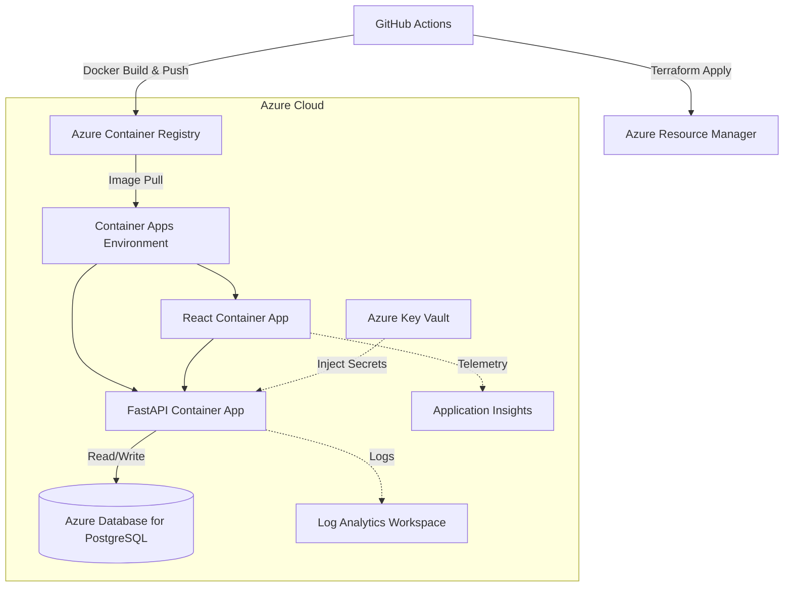

# Maintenance Platform Infrastructure

Infrastructure-as-code and CI/CD deployment platform for a containerized React, FastAPI, and PostgreSQL application on Microsoft Azure.

This repository deploys the full-stack system built in the [Work Order Management API](https://github.com/WilliamW-D/work-order-api) and [Maintenance Operations Dashboard](https://github.com/WilliamW-D/maintenance-ops-dashboard) repositories.

## Architecture

This infrastructure provisions:
1. **Azure Container Registry (ACR)**: Private Docker image hosting.
2. **Azure Container Apps**: Serverless container execution for the React frontend and FastAPI backend, capable of scaling to zero.
3. **Azure Database for PostgreSQL**: Fully managed relational database.
4. **Azure Key Vault**: Strict secrets management (database passwords and JWT keys are securely injected into the containers at runtime, never stored in plaintext).
5. **Azure Monitor & Application Insights**: Telemetry, logs, and health checking.

## Infrastructure as Code (Terraform)

The infrastructure is heavily modularized for enterprise reuse:
- `modules/container-app`: Provisions the serverless environment and applications.
- `modules/database`: Provisions the Flexible Server PostgreSQL instance.
- `modules/key-vault`: Configures secret storage and RBAC.
- `modules/monitoring`: Sets up analytics workspaces.

## CI/CD Pipeline

The `.github/workflows` directory contains two pipelines:
- `terraform.yml`: Validates Terraform formatting and configuration on Pull Requests.
- `deploy.yml`: Pushes code and applies infrastructure changes to the `dev` environment.
